# Distillery: shippable system design

Status: proposed

## 1. Product definition

Distillery is an evidence-to-decision system. Its primary output is not a PRD; it is a reviewable chain from source material to claims, decisions, initiative state, and finally requirements. A PRD is one projection of that chain.

The first release should prove one proposition:

> A product lead can capture scattered context with almost no friction, reliably recall it, and promote converging evidence into an approved initiative brief whose consequential statements are independently verifiable.

It should not initially attempt autonomous company-wide initiative discovery, a universal company knowledge graph, or autonomous TDD generation. Those features depend on a trustworthy evidence substrate and would otherwise make failures persuasive rather than visible.

### Assumptions

- Initial deployment serves one company, fewer than 1,000 users, and fewer than 10 million source items.
- A focused 4–6 person product/engineering team can ship a private v0 pilot in roughly 12–16 weeks; fewer people or enterprise-grade connector/security requirements extend this.
- The pilot captures context through text braindumps only; voice, file upload, URLs, and background company connectors are deferred.
- Humans remain authoritative for initiative approval, strategic fit, decisions, owners, and final documents.
- v0 uses a shared webapp password for a private pilot. Formal identity, SSO, RBAC, and source-level ACL enforcement are post-v0 requirements.
- Once formal source connectors are added, source access controls must be preserved in retrieval and citations.

## 2. Non-negotiable invariants

1. No consequential output statement exists without one of: direct evidence, a human decision, or an explicit `inference`/`assumption` label.
2. Source records are immutable. Corrections create new versions or annotations; they do not rewrite history.
3. A source observation, a normalized claim, and a human-approved decision are different record types.
4. Every generation run uses a frozen, versioned evidence bundle with an `as_of` timestamp.
5. Approval applies to a specific artifact version and evidence bundle, not to a mutable initiative in general.
6. New or revoked evidence can make a candidate or document stale, but cannot silently alter an approved artifact.
7. Retrieved content is never treated as instruction. It is untrusted data and is isolated from system prompts and tool authority.
8. A user may only retrieve or view evidence they are authorized to access. Generated output cannot launder restricted information.
9. Missing evidence is a first-class result. The system abstains instead of filling gaps with plausible prose.
10. All state changes and human actions are append-only audit events.

## 3. Corrected system boundary

```mermaid
flowchart LR
  S["Source connectors"] --> R["Immutable raw source store"]
  R --> O["Observations with exact spans"]
  O --> C["Versioned claims and relations"]
  C --> I["Human-created initiative workspace"]
  D["Decision and approval ledger"] --> I
  I --> B["Frozen evidence bundle"]
  B --> G["Schema-constrained brief generation"]
  G --> V["Deterministic trace and policy gates"]
  V --> H["Human review"]
  H -->|approve version| AB["Approved initiative brief"]
  H -->|revise| I
  AB --> P["PRD workflow"]
  P --> A["Approved PRD"]
  A --> T["TDD workflow"]
  R -. "source changed or access revoked" .-> X["Staleness evaluator"]
  C -. "claim superseded or contradicted" .-> X
  D -. "decision superseded" .-> X
  X --> I
  X --> A
```



The original architecture's stages remain useful, with three changes:

- “Company brain” becomes explicit stores with typed records and temporal versions.
- Human-controlled initiative formation is part of v0. The system recommends related signals, but cannot autonomously create, merge, approve, or prioritize initiatives.
- PRD and TDD generation are separate approval workflows. Engineering owns TDD approval after product requirements stabilize.

## 4. Core data model

Use PostgreSQL first. JSONB handles source-specific metadata, relational tables preserve invariants, and `pgvector` can support semantic retrieval. Do not introduce a graph database until measured queries require one.

The memory architecture is informed by MemGraphRAG's evidence/fact/schema separation, extended for company intelligence:

```text
immutable evidence
  <-> extracted observations
  <-> versioned claims
  <-> managed schema/taxonomy

claims <-> human decisions <-> initiative syntheses
```

PostgreSQL and immutable object storage are authoritative. Lexical indexes, embeddings, and any retrieval graph are derived projections that can be rebuilt without changing claims, decisions, or approvals. See [MEMORY_ARCHITECTURE.md](./MEMORY_ARCHITECTURE.md) for the paper/code analysis and detailed memory contract.

The v0 workflows and frontend contracts are specified in [MEMORY_GENERATION.md](./MEMORY_GENERATION.md) and [MEMORY_SYNTHESIS.md](./MEMORY_SYNTHESIS.md). Their implementation order is defined in [V0_BUILD_PLAN.md](./V0_BUILD_PLAN.md).

### Source and evidence

```text
source_connection
  id, tenant_id, type, config_ref, sync_cursor, status

source_item
  id, tenant_id, connection_id, external_id, version,
  canonical_url, title, author_id, occurred_at, ingested_at,
  content_hash, object_uri, acl_snapshot, deleted_at
  UNIQUE(connection_id, external_id, version)

evidence_span
  id, source_item_id, locator, exact_text, start_offset, end_offset,
  content_hash, extracted_at
```

`locator` must remain usable for source-native formats: page and bounding box for PDFs, paragraph/block ID for docs, message/thread ID for Slack, timestamp for recordings, or row/query identity for metrics.

### Knowledge layer

```text
observation
  id, evidence_span_id, subject_ref, predicate, object_value,
  modality, extractor_version, extraction_confidence, status

claim
  id, tenant_id, normalized_statement, claim_type,
  valid_from, valid_to, recorded_at, status, confidence_method

claim_support
  claim_id, observation_id, relation  // supports | contradicts | qualifies

claim_relation
  from_claim_id, relation, to_claim_id
  // duplicates | supersedes | depends_on | contradicts
```

Confidence must not be a single unexplained model number. Store its components: source reliability class, number and independence of supporting observations, recency, contradiction status, and human verification. The UI should show those components.

### Human authority

```text
decision
  id, initiative_id, decision_type, statement, rationale,
  status, owner_id, decided_by, decided_at, supersedes_decision_id

approval
  id, artifact_type, artifact_id, artifact_version,
  evidence_bundle_id, approver_id, role, disposition, comment, created_at

audit_event
  id, actor_type, actor_id, action, entity_type, entity_id,
  before_hash, after_hash, correlation_id, created_at
```

Models may propose decisions, but only authorized humans can create an effective approved decision.

### Initiatives and artifacts

```text
initiative
  id, title, problem_hypothesis, status, owner_id, strategy_period,
  created_by, created_at, updated_at

initiative_claim
  initiative_id, claim_id, role, disposition, reviewed_by
  // role: problem | user | impact | constraint | dependency | risk | metric
  // disposition: proposed | accepted | rejected

evidence_bundle
  id, initiative_id, version, as_of, manifest_hash,
  retrieval_policy_version, created_at

bundle_item
  bundle_id, claim_id, claim_version, evidence_span_id,
  source_item_version, inclusion_reason

artifact
  id, initiative_id, type, version, status, evidence_bundle_id,
  schema_version, generator_version, content_json, content_hash, created_at

artifact_assertion
  id, artifact_id, artifact_version, json_pointer, assertion_type,
  text, epistemic_status, owner_id

assertion_support
  assertion_id, support_type, support_id, relation
  // support_type: evidence_span | claim | decision | prior_artifact
```

`epistemic_status` is one of `evidenced`, `decided`, `inferred`, `assumed`, `proposed`, or `unknown`. Requirements must also carry a requirement owner and verification method.

## 5. The traceability contract

Treat traceability as a machine-enforced contract, not a citation-writing convention.

Each document section is generated as structured JSON. Example:

```json
{
  "assertion_id": "asrt_123",
  "kind": "requirement",
  "text": "Users must be able to export an audit log in CSV format.",
  "epistemic_status": "decided",
  "support": [
    {"type": "decision", "id": "dec_42"},
    {"type": "evidence_span", "id": "ev_91", "relation": "motivates"}
  ],
  "owner_id": "team_admin_platform",
  "verification": "Acceptance test AT-17"
}
```

The rendered PRD shows compact evidence badges. Selecting a badge opens the exact source passage, source metadata, claim transformation, contradictory evidence, and any human decision. An export includes a traceability appendix and a machine-readable manifest.

### Consequential assertions

At minimum, trace these atomically:

- problem and user claims;
- scope, requirements, and non-goals;
- metrics, baselines, and targets;
- dependencies, constraints, and owners;
- risks and mitigations;
- strategic-fit statements;
- recommendations and prioritization;
- assumptions and inferences.

Paragraph-level citations are insufficient because one paragraph often mixes supported and unsupported claims.

## 6. Candidate and artifact state machines

### Initiative

```text
draft -> evidence_review -> ready_for_brief -> brief_approved
  -> prd_drafting -> prd_review -> prd_approved -> tdd_drafting

Any nonterminal state -> deferred | rejected | merged | archived
Any state after evidence_review -> stale
stale -> evidence_review
```

Transitions require explicit predicates. Examples:

- `ready_for_brief`: named owner, current problem evidence, affected user evidence, no unresolved blocking contradiction, and recorded strategic decision.
- `brief_approved`: authorized product approver accepted a specific brief version.
- `prd_review`: all required sections pass structural and trace gates.
- `prd_approved`: product, engineering, and required domain approvers accepted the exact version.

### Freshness

Do not use a single “current?” model judgment. Compute staleness reasons:

- a bundled source has a newer version;
- a supporting claim is contradicted or superseded;
- a governing decision is superseded;
- an owner or dependency changed;
- an ACL was revoked;
- evidence exceeded a type-specific age policy;
- strategy period ended;
- required metrics are older than their freshness SLA.

Staleness is a bitset of reasons with severity. Severe staleness blocks approval or delivery; advisory staleness requires acknowledgment.

## 7. Generation pipeline

1. **Retrieve:** hybrid lexical/semantic retrieval constrained by tenant, ACL, source type, time, initiative, and decision status.
2. **Build context:** resolve duplicates, group contradictions, prefer current versions, and freeze the selected records into an evidence bundle.
3. **Plan coverage:** determine which required PRD fields have adequate support and list gaps before prose generation.
4. **Generate structured assertions:** require support IDs and epistemic labels in the model response. The model cannot mint IDs.
5. **Validate references:** reject unknown IDs, unauthorized sources, missing owners, malformed requirements, and uncited consequential assertions.
6. **Verify support:** use deterministic checks first; use a separate entailment/contradiction model only as a risk signal, never as proof.
7. **Render:** derive HTML/Markdown/PDF from validated structured content.
8. **Review:** show source and contradiction context inline; record each approval against hashes and versions.

The generator must be allowed to emit `insufficient_evidence` for a section. Output quality is measured partly by correct abstention.

## 8. Output gates

Hard blockers:

- trace coverage below 100% for consequential assertions;
- a citation points to a nonexistent, changed, or unauthorized span;
- a requirement has no owner or verification method;
- an unresolved high-severity contradiction affects scope, metric, dependency, or strategy;
- an effective decision is missing for scope or strategic fit;
- severe staleness exists;
- generated content contains support IDs absent from the evidence bundle;
- prompt-injection or data-exfiltration policy check fails.

Warnings requiring human acknowledgment:

- claims rely on one source or one participant;
- evidence is old but within policy;
- a recommendation is inferred rather than decided;
- a metric has no baseline or target;
- a dependency owner has not confirmed;
- source reliability is low or extraction confidence is low.

“Evidence density” is not enough: ten copies of the same unsupported statement are not independent evidence. Track source independence and origin lineage.

## 9. ADHD-friendly product experience

The v0 product shell is one screen with one universal text input. The input accepts:

- typed or pasted text braindumps;
- a natural-language question.

The system determines whether the user is asking Distillery to **Remember** new context or **Ask** existing memory. It must always make that interpretation visible and reversible. Ingestion cannot create or advance an initiative; Memory Synthesis begins downstream from stored memory.

### The Memory Generation screen

```text
Capture or ask
    -> visible processing receipt
    -> “Here is what I understood”
    -> memory-synthesis payload or cited answer
```

Below the input, the screen shows only the current result. It does not show initiative suggestions, candidate scores, initiative actions, readiness, or a history feed.

For captured material, the result displays the exact structured items that will be passed to Memory Synthesis:

- facts and signals;
- reported or proposed decisions;
- people, teams, products, and customers;
- risks, dependencies, and metrics.

Every item shows its type, normalized statement, exact source, and epistemic status. The user can correct or remove it inline. Extracted decisions remain `reported` or `proposed` until an authorized person confirms them.

For a question, the answer contains atomic citations. Selecting one reveals the exact source passage without leaving the screen. When support is missing or conflicting, the answer says so instead of completing the story.

Memory Synthesis runs downstream from these stored items. Its initiative review and approval workflow is not shown on the Memory Generation screen. Later versions may add focused PRD and TDD workspaces, but the ingestion screen remains unchanged.

## 10. Product milestones

Milestones are vertical, independently usable products. Infrastructure work is performed inside the milestone that first needs it; no milestone exits with only a platform layer.

### v0 — capture, recall, and approve an initiative brief

User promise: “Give Distillery scattered context. It will remember and retrieve it, recognize when signals may form an initiative, and help a human reviewer approve a trustworthy brief.”

v0 has two logical systems:

- **Memory Generation:** source ingestion, typed memory extraction, correction, retrieval, and evidence-backed answers.
- **Memory Synthesis:** related-memory grouping, initiative suggestions, readiness analysis, brief generation, trace review, and approval.

```text
Memory Generation -> trusted memory -> Memory Synthesis -> approved initiative brief
```

Both systems run as modules in the same deployable application and use the same evidence, authorization, versioning, and audit foundations.

End-to-end flow:

```text
text braindump
  -> immutable source record
  -> exact source spans
  -> typed memory extraction
  -> deduplication and contradiction hints
  -> memory storage
  -> visible capture receipt with corrections
  -> cited recall through the same input
  -> related-signal suggestion
  -> human create/attach/merge/ignore action
  -> evidence-backed initiative workspace
  -> readiness check and gap resolution
  -> versioned human-approved initiative brief
```

Scope:

- one screen and one universal input;
- text/paste braindump capture;
- extraction of typed memory records linked to exact source spans;
- inline confirm, correct, merge, and delete;
- retrieval and cited answers through the same input;
- immutable source versions, audit history, basic tenant isolation, and deletion;
- explicit `unverified`, `confirmed`, `inferred`, and `conflicting` states;
- related-signal suggestions and manual initiative creation;
- initiative evidence grouping, owners, dependencies, risks, metrics, evidence gaps, and strategic decisions;
- transparent readiness rules, versioned evidence bundles, brief generation, review, approval, and Markdown export.

Not in v0: automatic initiative creation or prioritization, opaque maturity scoring, PRDs, TDDs, broad connectors, or background company monitoring.

Exit: pilot users rely on Distillery for capture and recall, and at least three real clusters of context become approved initiative briefs whose consequential assertions reviewers can verify in under five minutes.

### v1 — approved initiative to approved PRD

User promise: “Given an approved initiative brief, Distillery creates a reviewable PRD without hiding gaps, stale context, or unsupported recommendations.”

End-to-end flow:

```text
approved initiative brief
  -> frozen evidence bundle
  -> coverage plan and explicit gaps
  -> schema-constrained PRD draft
  -> trace, contradiction, dependency, and freshness gates
  -> human revision and version diff
  -> role-based approval
  -> Markdown/API delivery
```

Exit: 3–5 real initiatives produce PRDs that teams choose to execute, with 100% trace coverage for consequential assertions and no known unsupported assertion escaping hard gates.

### v2 — approved PRD to approved TDD

User promise: “Distillery combines an approved PRD with current engineering context to produce a technically reviewable implementation design.”

Scope adds repository and architecture evidence, API and data contracts, security and operational requirements, migration and rollback plans, test strategy, engineering ownership, and engineering approval. Product decisions and engineering design decisions remain separate typed records.

Exit: engineering approves a TDD version whose requirements map bidirectionally to the PRD and whose technical claims map to code, architecture evidence, or explicit engineering decisions.

### v3 — continuous organizational sensing

User promise: “Distillery keeps initiatives and artifacts current as company context changes.”

Scope adds production connectors, background synchronization, source ACL propagation, staleness events, candidate discovery, duplicate initiatives, portfolio views, and role-specific action prompts.

Exit: the system catches material changed context before humans approve or execute stale artifacts, without creating an unmanageable notification stream.

## 11. Minimal deployable architecture

- **Web app/API:** one modular monolith deployed as a Cloudflare Worker; avoid premature microservices.
- **Database:** Supabase PostgreSQL accessed from Workers through Supabase HTTP APIs and Postgres RPC functions; use `pgvector` with 1536-dimensional recall embeddings.
- **Blob store:** Cloudflare R2 for immutable original content and normalized snapshots when inputs exceed practical PostgreSQL row storage.
- **Workers/queue:** Cloudflare Queues and background Workers for parsing, extraction, embedding, freshness evaluation, and generation jobs.
- **Model gateway:** OpenRouter integration with `moonshotai/kimi-k2.7-code` as primary plus configured Moonshot fallbacks, prompt/version registry, provider abstraction, structured-output validation, redaction, budget limits, and complete run logs.
- **Policy engine:** shared-password gate, state transition guards, reviewer metadata, and output gates.
- **Renderer:** deterministic PRD/TDD projections from artifact JSON.
- **Observability:** trace each ingestion and generation run by correlation ID; record model, prompt, bundle, policy, latency, tokens, cost, and failures.

Use an outbox table for reliable event publication. Make every Worker job idempotent using `(job_type, entity_id, input_version, processor_version)` as the deduplication key. Dead-letter failed jobs; never silently skip them. Long-running model or retrieval workflows should be resumable queue/workflow steps, not one HTTP request.

Cloudflare Hyperdrive is deferred. It is only needed if the Worker runtime later needs direct PostgreSQL drivers, ORM access, or LangGraph's PostgreSQL checkpoint saver instead of Supabase HTTP/RPC.

## 12. API surface by product milestone

### v0

```text
POST   /captures                       // text braindump
GET    /captures/{id}                  // processing receipt and extracted memory
POST   /captures/{id}/retry
POST   /queries                        // ask existing memory

GET    /memory/{id}
PATCH  /memory/{id}                    // correct or confirm
POST   /memory/{id}/merge
DELETE /memory/{id}

GET    /evidence/{span_id}
GET    /history
DELETE /account/data
GET    /evidence/search

POST   /initiatives
GET    /initiatives/{id}
POST   /initiatives/{id}/claims
POST   /initiatives/{id}/decisions
POST   /initiatives/{id}/transition
GET    /initiatives/{id}/readiness

POST   /initiatives/{id}/bundles
POST   /initiatives/{id}/briefs:generate
GET    /briefs/{id}/trace
POST   /briefs/{id}/reviews
POST   /briefs/{id}/approvals
GET    /briefs/{id}/export
```

### v1 — PRD

```text
POST   /initiatives/{id}/prds:generate
GET    /artifacts/{id}/trace
POST   /artifacts/{id}/reviews
POST   /artifacts/{id}/approvals
GET    /artifacts/{id}/export
```

v2 adds engineering-source and TDD endpoints. v3 adds source-connection and background synchronization endpoints.

All mutating calls accept an idempotency key. State-changing calls require an expected entity version to prevent lost updates.

## 13. Evaluation and release thresholds

Evaluate components separately; a single “output quality” score hides failures.

### Offline

- source locator validity: 100%;
- consequential assertion trace coverage: 100%;
- citation precision: at least 95% on the golden set;
- unsupported-assertion escape rate: 0 in release-blocking tests;
- contradiction recall: establish baseline, then require at least 90% for labeled high-severity conflicts;
- stale/superseded source detection: 100% for deterministic version cases;
- retrieval recall at 20: at least 90% for labeled supporting passages;
- correct abstention on unanswerable fields: at least 90%.

### Pilot

- median time for a reviewer to verify a sampled assertion;
- median time from initiative creation to reviewable PRD;
- percentage of generated assertions edited or deleted;
- percentage of warnings accepted versus corrected;
- stale evidence and contradictions caught before approval;
- reviewer trust score, measured only after reviewers complete verification tasks;
- adoption: proportion of pilot initiatives whose teams continue with the artifact.

Do not optimize prose preference before trace precision, retrieval recall, and abstention pass thresholds.

## 14. Threat model and reliability risks

| Risk | Control |
|---|---|
| Prompt injection in Slack/docs | Treat source content as quoted data; no tools available to the generation model; scan and flag instruction-like text |
| Hallucinated citations | Model may only select IDs from a frozen allowlist; reject every unknown ID |
| Citation exists but does not support text | Atomic assertions, deterministic type checks, independent support-risk model, and human sampling |
| Stale but persuasive PRD | Versioned bundles, freshness events, stale badge, and delivery-blocking severity rules |
| Permission laundering | Query-time ACL filters plus approval/export checks; revoke affected artifacts when access changes |
| Repetition mistaken for corroboration | Track shared origin and source independence |
| Model quietly changes scope | Compare artifact versions structurally; require a decision for scope changes |
| Human rubber-stamping | Role-specific review tasks, sampled evidence checks, approval rationale, and audit metrics |
| Extraction errors become facts | Observations remain proposals; claims expose exact spans and verification status |
| Global-memory corruption | Never overwrite facts in place; use temporal claims, supersession edges, and audit events |

## 15. What not to build first

- autonomous company-wide initiative discovery;
- one opaque maturity score;
- a graph database;
- multi-agent orchestration;
- automatic strategic-fit judgments;
- polished PDF generation;
- external market/news ingestion;
- autonomous TDDs;
- fine-tuned models;
- a chat-first interface over all company data.

These features increase surface area before the system can prove provenance, currentness, authorization, and useful abstention.

## 16. Immediate decisions

Before implementation, choose and record:

1. Pilot team and 3–5 real initiatives.
2. Canonical PRD schema and which fields are consequential.
3. First connector based on the pilot's actual evidence, not connector prestige.
4. Identity provider and source ACL semantics.
5. Approval roles and which transitions each role controls.
6. Freshness policies by evidence type.
7. Data retention, deletion, legal hold, and model-provider boundaries.
8. Golden-set owners and release thresholds.

The first engineering ticket should be the typed assertion/evidence/decision schema plus validator. The first product prototype should be the citation-review interaction. If those two pieces are weak, every later feature compounds the wrong foundation.
