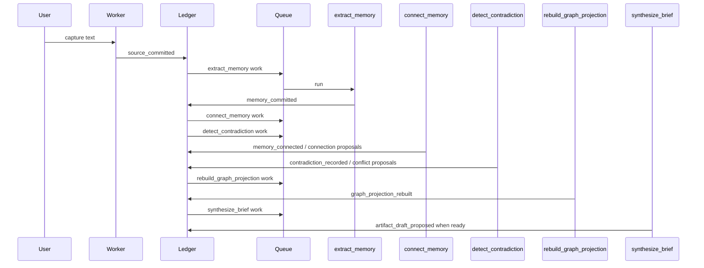
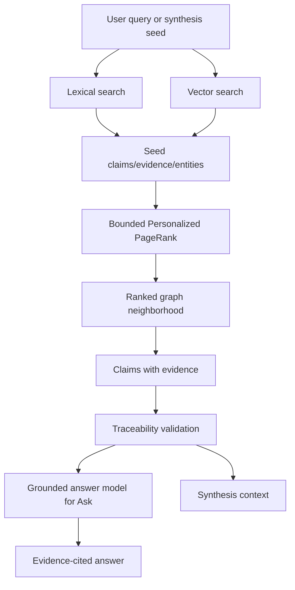

# Claim graph memory upgrade implementation plan

Status: proposed implementation contract, written 2026-07-09.

This plan upgrades Distillery from v0 `memory_items` plus transient synthesis bundles to a pilot-grade claim graph inspired by MemGraphRAG. It is written for an implementation LLM. Follow this document as the source of truth for this upgrade, while using [STATUS_AND_ROADMAP.md](../current/STATUS_AND_ROADMAP.md) as the source of truth for what is implemented today.

Related docs:

- Docs index: [README.md](../README.md)
- Current state: [STATUS_AND_ROADMAP.md](../current/STATUS_AND_ROADMAP.md)
- Loop system PRD: [LOOP_SYSTEM_PRD.md](./LOOP_SYSTEM_PRD.md)
- Memory synthesis policy PRD: [MEMORY_SYNTHESIS_POLICY_PRD.md](./MEMORY_SYNTHESIS_POLICY_PRD.md)
- Memory architecture and MemGraphRAG notes: [MEMORY_ARCHITECTURE.md](../architecture/MEMORY_ARCHITECTURE.md)
- MemGraphRAG paper: [2606.00610v1.pdf](../research/2606.00610v1.pdf)

## Implementation-agent instructions

Before coding:

1. Read this whole file.
2. Read [STATUS_AND_ROADMAP.md](../current/STATUS_AND_ROADMAP.md).
3. Read [LOOP_SYSTEM_PRD.md](./LOOP_SYSTEM_PRD.md) and [MEMORY_SYNTHESIS_POLICY_PRD.md](./MEMORY_SYNTHESIS_POLICY_PRD.md).
4. Inspect the current code before editing. Do not assume the docs and code are perfectly aligned.

Do not implement a separate MemGraphRAG service. Do not add a graph database. Do not call model providers directly from policy modules. All model calls must go through `packages/model-gateway`.

This is a pilot-stage product. The user approved a fresh database reset and curated reseed if that is the cleanest implementation path. This approval applies to local/dev databases and the live pilot database, but destructive reset commands still require an explicit human command at execution time for the specific target database. Do not wipe a database just because this plan says the design permits it.

## Objective

Add durable, reviewable, evidence-backed memory connections so Distillery can:

- connect related claims across sources;
- detect blocking conflicts before synthesis;
- retrieve through lexical, vector, and graph signals;
- synthesize better initiative briefs from graph-expanded memory;
- give reviewers a graph UI for inspecting and correcting memory connections.

The highest-priority success metric is better initiative briefs. Recall quality and reviewer trust are also success metrics.

## Current repo baseline

The implementation starts from the current repository, not a greenfield system.

Current implemented behavior:

- `apps/web/src/index.ts` is a Cloudflare Worker that renders HTML and exposes capture, recall, synthesis, memory review, and brief routes.
- `extract_memory` and `synthesize_brief` are real policies in `packages/loop`.
- Other policy names exist, but most are deterministic placeholders.
- `packages/model-gateway` supports OpenRouter chat completions for memory generation and initiative brief drafting.
- There is no embedding client in `packages/model-gateway` yet.
- `packages/memory-synthesis` builds transient `SynthesisBundle` objects from active memory. These connections are not persisted.
- `memory_entities`, `memory_relations`, and `memory_schemas` exist and are populated from extraction output.
- `claim_embeddings` and `evidence_span_embeddings` tables exist, but embedding generation and hybrid retrieval are not implemented.
- `distillery_recall_memory_lexical` is deterministic lexical recall.
- `distillery_get_memory_synthesis_context` returns recent active memory. It does not perform graph expansion.

Known current mismatch:

- `docs/current/STATUS_AND_ROADMAP.md` says the embedding model is `qwen/qwen3-embedding-8b`.
- `apps/web/wrangler.toml` currently sets `EMBEDDING_MODEL = "deepseek/deepseek-v4-flash"`.
- The human confirmed OpenRouter embedding access for `qwen/qwen3-embedding-8b`.
- This upgrade must standardize on `qwen/qwen3-embedding-8b` with `EMBEDDING_DIMENSIONS=1536` unless the human explicitly chooses another OpenRouter embedding model with 1536 output dimensions.
- Update `apps/web/wrangler.toml`, local environment examples, and Worker vars so `EMBEDDING_MODEL` is not a chat-completion model.

Current transient synthesis risk:

- `complementary_claim_type` can connect unrelated memories when no shared entity, schema, evidence, or semantic support exists.
- Replace this with scored, inspectable, persisted connection logic.

## MemGraphRAG lessons to borrow

Borrow these ideas:

- separate passage/evidence, concrete facts, and abstract schemas;
- treat extracted facts as hypotheses until they are filtered, supported, or reviewed;
- build the retrieval graph as a projection of memory, not as the canonical source of truth;
- detect conflicts before synthesis;
- use graph traversal, especially bounded Personalized PageRank, to expand from seed claims to useful adjacent evidence.

Do not borrow these behaviors directly:

- destructive conflict resolution that discards or rewrites facts;
- JSON snapshot memory as canonical storage;
- frequency-only schema filtering;
- coarse passage-only provenance;
- external graph runtime as a new production dependency.

Distillery's authoritative memory must remain append-only, evidence-backed, temporal, auditable, and reviewable.

## Target architecture

```mermaid
flowchart LR
  Source[Source item] --> Version[Source version]
  Version --> Evidence[Evidence spans]
  Evidence --> Observation[Observations]
  Observation --> Claim[Claims]
  Claim --> ClaimEvidence[Claim evidence links]
  Claim --> Entity[Entities and aliases]
  Claim --> Predicate[Predicates]
  Claim --> Schema[Schema patterns]
  Claim --> Connection[Claim connections]
  Claim --> Conflict[Conflict groups]

  Claim --> Embedding[Embeddings]
  Evidence --> Embedding
  Entity --> Embedding
  Schema --> Embedding

  Claim --> Projection[Graph projection]
  Entity --> Projection
  Schema --> Projection
  Evidence --> Projection

  Projection --> Retrieval[Graph retrieval]
  Retrieval --> Recall[Ask/recall]
  Retrieval --> Synthesis[Synthesize brief]
  Connection --> Review[/graph review UI]
  Conflict --> Review
```

The canonical flow is:

```text
source evidence
  -> observations
  -> normalized claims
  -> durable claim connections and conflicts
  -> rebuildable graph projection
  -> graph retrieval
  -> recall and synthesis
```

## External dependencies

No new external service, signup, graph database, MemGraphRAG hosted service, LangGraph service, or direct OpenAI dependency is allowed.

Required existing services:

```text
Supabase/PostgreSQL with pgvector
Cloudflare Workers and Queue
OpenRouter for chat completions and embeddings
```

Required local environment values:

```text
DATABASE_DIRECT_URL
DATABASE_URL
SUPABASE_URL
SUPABASE_SECRET_KEY
OPENROUTER_API_KEY
OPENROUTER_BASE_URL=https://openrouter.ai/api/v1
OPENROUTER_MODEL
OPENROUTER_FALLBACK_MODELS
OPENROUTER_TIMEOUT_MS
OPENROUTER_FALLBACK_TIMEOUT_MS
EMBEDDING_PROVIDER=openrouter
EMBEDDING_BASE_URL=https://openrouter.ai/api/v1
EMBEDDING_MODEL=qwen/qwen3-embedding-8b
EMBEDDING_DIMENSIONS=1536
EMBEDDING_ENCODING_FORMAT=float
DISTILLERY_APP_PASSWORD
```

Required Worker secrets:

```text
DISTILLERY_APP_PASSWORD
SUPABASE_URL
SUPABASE_SECRET_KEY
OPENROUTER_API_KEY
```

Required Worker vars:

```text
OPENROUTER_BASE_URL
OPENROUTER_MODEL
OPENROUTER_FALLBACK_MODELS
OPENROUTER_TIMEOUT_MS
OPENROUTER_FALLBACK_TIMEOUT_MS
EMBEDDING_PROVIDER
EMBEDDING_BASE_URL
EMBEDDING_MODEL
EMBEDDING_DIMENSIONS
EMBEDDING_ENCODING_FORMAT
```

New code dependency:

- Add D3 for `/graph`.
- Use the `d3` npm package or explicitly imported D3 subpackages.
- Bundle D3 locally through the app/package build or serve a vendored local asset.
- Do not use Cytoscape.js.
- Do not use a CDN.

OpenRouter embedding access for `qwen/qwen3-embedding-8b` is confirmed by the human. Stop and ask the human only if the selected embedding model is unavailable at implementation time or if a replacement model would change vector dimensions.

## Data model

Implement a fresh pilot schema migration. Because the user approved a pilot reset, the migration may drop or replace v0 domain memory tables if this keeps the implementation cleaner. Keep or recreate source/evidence tables, loop tables, audit tables, and initiative brief tables with compatibility RPCs.

The table definitions below are minimum required schema, not loose suggestions. An implementation may add columns or indexes, but it must not omit any listed column, tenant scope, review/audit field, evidence reference, or uniqueness requirement unless this document explicitly marks it optional.

### Canonical tables

Add or rebuild these tables.

#### `observations`

Stores raw extracted assertions grounded in evidence.

Required semantics:

- one observation means "this evidence appears to say X";
- observations are append-only;
- human or model corrections create new records or review records, not silent mutation;
- an observation may map to zero, one, or many claims.

Minimum columns:

```text
id text primary key
tenant_id text not null
evidence_span_id text not null
extraction_run_id text
observation_type text not null
raw_statement text not null
subject_mention text
predicate_mention text
object_value jsonb
modality text
negated boolean not null default false
qualifiers jsonb not null default '{}'::jsonb
valid_time_start timestamptz
valid_time_end timestamptz
extraction_confidence numeric
review_state text not null default 'unreviewed'
created_at timestamptz not null default now()
```

#### `claims`

Stores normalized, versioned memory units.

Required semantics:

- claims are the successor to `memory_items`;
- claims remain evidence-backed;
- claims can be superseded, rejected, confirmed, or scoped without deleting history;
- valid time and recorded time are first-class.

Minimum columns:

```text
id text primary key
tenant_id text not null
claim_type text not null
statement text not null
subject_entity_id text
predicate_id text
object_json jsonb
epistemic_status text not null
qualifiers jsonb not null default '{}'::jsonb
stable_domain_tags jsonb not null default '[]'::jsonb
valid_time_start timestamptz
valid_time_end timestamptz
recorded_at timestamptz not null default now()
review_state text not null default 'unreviewed'
supersedes_claim_id text
source_version_id text
ingestion_id text
created_at timestamptz not null default now()
updated_at timestamptz not null default now()
```

#### `claim_evidence`

Connects claims to evidence.

Allowed roles:

```text
supports
contradicts
qualifies
motivates
```

Minimum columns:

```text
claim_id text not null
evidence_span_id text not null
tenant_id text not null
role text not null
observation_id text
created_at timestamptz not null default now()
primary key (claim_id, evidence_span_id, role)
```

#### `entities` and `entity_aliases`

Stores canonical entities and aliases promoted from memory mentions.

Required semantics:

- model-mediated promotion is allowed in pilot mode;
- every promotion stores rationale and supporting observations;
- aliases preserve original mentions.

Minimum `entities` columns:

```text
id text primary key
tenant_id text not null
canonical_name text not null
entity_type text not null
description text
promotion_state text not null default 'auto_promoted'
promotion_rationale text
supporting_observation_ids jsonb not null default '[]'::jsonb
created_at timestamptz not null default now()
updated_at timestamptz not null default now()
```

Minimum `entity_aliases` columns:

```text
id text primary key
tenant_id text not null
entity_id text not null
alias text not null
source text not null
created_at timestamptz not null default now()
```

#### `predicates`

Stores normalized relation/action names.

Minimum columns:

```text
id text primary key
tenant_id text not null
canonical_name text not null
description text
created_at timestamptz not null default now()
```

#### `schema_patterns`

Stores abstract semantic patterns such as `(Team, owns, Initiative)`.

Required semantics:

- do not reject rare schemas only because they are rare;
- auto-promote frequent or strongly supported patterns in pilot mode;
- keep candidate/rejected/stable status visible.

Minimum columns:

```text
id text primary key
tenant_id text not null
subject_type text not null
predicate_id text
predicate_name text not null
object_type text not null
status text not null default 'candidate'
support_count integer not null default 0
promotion_rationale text
created_at timestamptz not null default now()
updated_at timestamptz not null default now()
```

#### `claim_connections`

Stores positive and actionable memory links.

Supported connection types:

```text
same_initiative_signal
supports
depends_on
blocks
duplicates
refines
motivates
related_context
```

Required semantics:

- connections are proposals by default;
- each connection stores score components, rationale, and evidence;
- accepted/rejected reviewer state is persisted;
- do not connect claims solely because their `claim_type` values are complementary.

Minimum columns:

```text
id text primary key
tenant_id text not null
from_claim_id text not null
to_claim_id text not null
connection_type text not null
status text not null default 'proposed'
confidence numeric not null
score_components jsonb not null default '{}'::jsonb
evidence_span_ids jsonb not null default '[]'::jsonb
rationale text
created_by_policy_run_id text
reviewer_label text
review_rationale text
created_at timestamptz not null default now()
updated_at timestamptz not null default now()
```

#### `conflict_groups`, `conflict_members`, `conflict_resolutions`

Stores contradictions without destroying original claims.

Supported conflict types:

```text
mutual
temporal
granularity
scope
decision
ownership
dependency
metric_definition
```

Required semantics:

- unresolved blocking conflicts stop auto-synthesis;
- both sides of a conflict remain queryable;
- resolution creates a new record and may set current interpretation, but never erases claims or evidence.

Minimum `conflict_groups` columns:

```text
id text primary key
tenant_id text not null
conflict_type text not null
severity text not null
status text not null default 'open'
summary text not null
created_by_policy_run_id text
created_at timestamptz not null default now()
updated_at timestamptz not null default now()
```

Minimum `conflict_members` columns:

```text
conflict_group_id text not null
claim_id text not null
role text not null
evidence_span_ids jsonb not null default '[]'::jsonb
primary key (conflict_group_id, claim_id)
```

Minimum `conflict_resolutions` columns:

```text
id text primary key
tenant_id text not null
conflict_group_id text not null
resolution_type text not null
winning_claim_id text
rationale text not null
reviewer_label text not null
created_at timestamptz not null default now()
```

#### `graph_nodes` and `graph_edges`

Stores a rebuildable retrieval/UI projection.

Required semantics:

- graph projection is not canonical memory;
- it can be deleted and rebuilt from claims, evidence, entities, schema patterns, connections, and conflicts;
- graph node IDs should be stable and typed, for example `claim:<id>`, `entity:<id>`, `schema:<id>`, `evidence:<id>`.

Minimum `graph_nodes` columns:

```text
id text primary key
tenant_id text not null
node_type text not null
ref_id text not null
label text not null
properties jsonb not null default '{}'::jsonb
created_at timestamptz not null default now()
updated_at timestamptz not null default now()
```

Minimum `graph_edges` columns:

```text
id text primary key
tenant_id text not null
from_node_id text not null
to_node_id text not null
edge_type text not null
weight numeric not null default 1
properties jsonb not null default '{}'::jsonb
created_at timestamptz not null default now()
updated_at timestamptz not null default now()
```

### Embedding tables

Replace or extend existing embedding tables so they cover:

```text
claims
evidence_spans
entities
schema_patterns
```

The simplest acceptable implementation is one generic table:

```text
memory_embeddings
  id text primary key
  tenant_id text not null
  target_type text not null
  target_id text not null
  embedding_model text not null
  embedding vector(1536) not null
  content_hash text not null
  created_at timestamptz not null default now()
```

Required unique key:

```text
unique (tenant_id, target_type, target_id, embedding_model, content_hash)
```

## Compatibility requirements

Existing product flows must keep working:

- `/`
- `/synthesis`
- memory review actions
- brief approval/rejection flows
- `POST /api/ingestions`
- `GET /api/ingestions/:id`
- `POST /api/queries`
- `POST /api/initiative-brief-drafts`
- loop status APIs

If the canonical table changes from `memory_items` to `claims`, provide compatibility views/RPCs that still return the current `MemoryItem` shape expected by `packages/contracts`:

```text
id
ingestionId
sourceVersionId
claimType
statement
evidenceSpanIds
epistemicStatus
qualifiers
stableDomainTags
entities
relations
schemas
reviewState
supersedesMemoryItemId
```

Do not force a broad frontend rewrite before the graph upgrade is functional.

The following currently called RPC names must continue to exist with compatible response shapes, even if they become wrappers over `claims`:

```text
distillery_create_text_ingestion_with_evidence
distillery_get_ingestion_context
distillery_update_ingestion_status
distillery_record_extraction_run
distillery_commit_generated_memory
distillery_fail_ingestion
distillery_get_ingestion_result
distillery_apply_memory_item_action
distillery_get_memory_item_history
distillery_recall_memory_lexical
distillery_list_active_memory
distillery_get_memory_synthesis_context
distillery_create_initiative_brief
distillery_list_initiative_briefs
distillery_get_initiative_brief
distillery_record_initiative_brief_decision
```

## Policy pipeline

Target event flow:



Required changes:

1. Add a real `connect_memory` policy.
2. Replace placeholder `detect_contradiction` with real logic.
3. Add graph projection rebuild behavior.
4. Keep `synthesize_brief`, but change its input to use graph-expanded claims and blocking conflict checks.

If adding `rebuild_graph_projection` as a policy name causes too much scope, implement it as a deterministic persistence method called after connection/conflict writes. Prefer a first-class policy if the loop contract can be kept clean.

Contract updates required:

- Add `connect_memory` to `POLICY_NAMES`, TypeScript policy registration, SQL `pending_work.policy` constraints, and event routing.
- If `rebuild_graph_projection` is implemented as a policy, add it to the same policy contracts and SQL constraints. If it is implemented as a deterministic persistence method, do not add a policy enum.
- Add `memory_connected` and, if using a first-class graph projection event, `graph_projection_rebuilt` to ledger event contracts and SQL event constraints.
- Add proposed event types for connection proposals and graph projection proposals if those flows use `proposed_events`; otherwise document why the persistence method writes deterministic committed effects.
- Update validation gates so every new event/proposed-event payload is Zod-validated and tenant scoped.
- Update `eventRoutes` so `memory_committed` routes to `connect_memory`, `detect_contradiction`, and graph-expanded `synthesize_brief` in a deterministic order.

## Extraction and promotion

Extend memory generation handling:

1. Save the raw model output as observations.
2. Normalize observations into claims.
3. Create claim-evidence links.
4. Promote entities, predicates, and schema patterns.
5. Store promotion rationale and supporting observation IDs.
6. Generate embeddings for claims, evidence spans, entities, and schema patterns.
7. Rebuild graph projection edges for the new/changed claims.

Promotion policy:

- Pilot mode may allow the model to decide entity/schema promotion.
- Persist model rationale.
- Keep low-frequency but high-authority items visible.
- Never erase source evidence.

## Connection generation

Generate connections in two passes.

### Pass 1: deterministic candidates

Use deterministic rules to propose candidate pairs:

- shared canonical entity;
- same or compatible schema pattern;
- same evidence span;
- same source/thread/context;
- explicit relation in extraction output;
- supersession/edit lineage;
- decision reference;
- dependency or owner overlap;
- duplicate normalized statement hash.

### Pass 2: semantic/model scoring

Use embeddings and, where necessary, model-gateway scoring to classify candidate links.

Score components should include:

```text
entity_overlap
schema_overlap
evidence_overlap
source_context_overlap
relation_compatibility
embedding_similarity
temporal_compatibility
claim_type_compatibility
model_confidence
review_prior
```

Important rule:

- `claim_type_compatibility` may increase a score only when at least one grounding signal exists: entity, schema, evidence, source context, relation, or embedding similarity above threshold.
- It must not create a connection by itself.

Default thresholds for pilot:

```text
auto_accept deterministic duplicate: >= 0.95 and exact evidence/statement support
propose strong connection: >= 0.72
propose weak related_context: >= 0.55
discard below: < 0.55
```

Make thresholds constants with tests, not hidden prompt text.

## Conflict detection

Run conflict detection when new claims are committed or edited.

Candidate generation:

- same subject entity and predicate with incompatible object;
- same metric name with incompatible definition/window;
- same initiative with incompatible owner/status/scope;
- dependency says both `blocks` and `unblocked`;
- decision claims with conflicting approval state;
- semantic near-neighbor claims with opposing polarity or temporal overlap.

Classification:

- deterministic checks first;
- model-assisted classification only through `packages/model-gateway`;
- model output must be validated with Zod/contracts;
- every conflict must cite evidence spans.

Synthesis behavior:

- unresolved `severity = blocking` conflicts stop auto-drafting;
- nonblocking conflicts are passed into recall/synthesis as warnings with contrary evidence;
- generated briefs must not present a conflicted claim as settled unless a resolution exists.

## Graph retrieval

Implement graph retrieval by default for:

- `POST /api/queries`;
- `POST /api/initiative-brief-drafts`;
- background `synthesize_brief`.

For `POST /api/queries`, graph retrieval is the context selection step. Ask must then use a grounded LLM answer-generation step through `packages/model-gateway` by default. Keep deterministic lexical recall and deterministic cited answer generation as fallback paths when graph retrieval or answer generation fails validation.

Retrieval flow:



Implementation requirements:

- seed graph traversal from lexical and vector results;
- run bounded PPR in TypeScript over rows from `graph_edges`;
- cap traversal by tenant, node count, edge count, and time budget;
- return claims and evidence spans, not graph nodes alone;
- preserve traceability validation before model generation;
- fallback to lexical recall if embeddings, graph projection, or PPR fail;
- for Ask, pass only the retrieved claims, evidence spans, conflict warnings, and question to the answer-generation model.

## Grounded Ask answers

Ask should give useful natural-language answers, not only a deterministic list of matched claims.

Required Ask behavior:

- retrieve context with lexical, vector, and graph signals;
- include open blocking and nonblocking conflicts relevant to the retrieved claims;
- call a grounded answer-generation model through `packages/model-gateway`;
- require every substantive answer sentence or bullet to be grounded in retrieved claims/evidence;
- cite evidence span IDs in the returned answer;
- explicitly say when evidence is missing, partial, stale, or conflicted;
- never invent owners, metrics, dates, approvals, decisions, dependencies, launch states, or causality;
- return retrieval metadata and answer-generation metadata for debugging;
- fall back to deterministic cited answer generation if the model call fails, times out, returns invalid JSON, cites unavailable evidence, or makes unsupported claims.

The LLM is an answer writer, not the source of truth. Retrieval determines what the model is allowed to know.

Default pilot caps:

```text
max seed claims: 20
max graph nodes loaded: 500
max graph edges loaded: 2000
max PPR iterations: 20
PPR damping: 0.5
minimum returned claims: 1
maximum returned claims for recall: 8
maximum returned claims for synthesis: 12
```

## Model gateway changes

Add embedding support and grounded Ask answer-generation support to `packages/model-gateway`.

Required embedding interface:

```ts
export type EmbeddingRequest = {
  input: string[];
  targetType: "claim" | "evidence_span" | "entity" | "schema_pattern";
};

export type EmbeddingResponse = {
  vectors: number[][];
  model: string;
};

export interface EmbeddingModel {
  embed(request: EmbeddingRequest): Promise<EmbeddingResponse>;
}
```

Required implementation:

- OpenRouter `/embeddings` client;
- timeout handling;
- model metadata in policy runs;
- dimension validation against `EMBEDDING_DIMENSIONS`;
- tests with mocked fetch;
- no direct embedding calls from app routes or policy modules.

If Slice 4 uses model-assisted connection scoring or conflict classification, it must add explicit model-gateway interfaces and Zod-validated output schemas. Policy modules must not call OpenRouter directly.

Required grounded Ask implementation:

- OpenRouter chat-completions client using the existing configured `OPENROUTER_MODEL` and fallback settings;
- strict JSON output schema validated with Zod/contracts;
- timeout handling;
- model metadata in API responses and policy/run metadata where applicable;
- tests with mocked fetch;
- no direct answer-generation calls from app routes outside `packages/model-gateway`.

Minimum answer-generation interface:

```ts
export type GroundedAnswerRequest = {
  question: string;
  claims: GraphRetrievalClaim[];
  evidenceSpans: EvidenceSpan[];
  conflicts: Array<{
    conflictGroupId: string;
    severity: "blocking" | "warning";
    summary: string;
    claimIds: string[];
    evidenceSpanIds: string[];
  }>;
};

export type GroundedAnswerResponse = {
  answer: string;
  citations: Array<{
    evidenceSpanId: string;
    claimIds: string[];
  }>;
  usedClaimIds: string[];
  usedEvidenceSpanIds: string[];
  warnings: string[];
  gap?: string;
  model: string;
};

export interface GroundedAnswerModel {
  generateGroundedAnswer(request: GroundedAnswerRequest): Promise<GroundedAnswerResponse>;
}
```

Grounded answer validation must reject responses that cite evidence spans or claims outside the retrieved context, omit citations for substantive assertions, or present unresolved conflicts as settled.

Minimum connection scoring interface:

```ts
export type ConnectionScoringRequest = {
  candidates: Array<{
    fromClaim: GraphRetrievalClaim;
    toClaim: GraphRetrievalClaim;
    deterministicSignals: Record<string, number | boolean | string>;
  }>;
};

export type ConnectionScoringResponse = {
  scoredConnections: Array<{
    fromClaimId: string;
    toClaimId: string;
    connectionType: ClaimConnectionType;
    confidence: number;
    scoreComponents: Record<string, number>;
    evidenceSpanIds: string[];
    rationale: string;
  }>;
  model: string;
};

export interface ConnectionScoringModel {
  scoreConnections(request: ConnectionScoringRequest): Promise<ConnectionScoringResponse>;
}
```

Minimum conflict classification interface:

```ts
export type ConflictClassificationRequest = {
  candidates: Array<{
    claims: GraphRetrievalClaim[];
    deterministicSignals: Record<string, number | boolean | string>;
  }>;
};

export type ConflictClassificationResponse = {
  conflicts: Array<{
    conflictType: ConflictType;
    severity: "blocking" | "warning";
    summary: string;
    members: Array<{
      claimId: string;
      role: string;
      evidenceSpanIds: string[];
    }>;
    rationale: string;
  }>;
  model: string;
};

export interface ConflictClassificationModel {
  classifyConflicts(request: ConflictClassificationRequest): Promise<ConflictClassificationResponse>;
}
```

If these interfaces introduce shared types such as `GraphRetrievalClaim`, `ClaimConnectionType`, or `ConflictType`, define and export them from `packages/contracts` so app, db, loop, and model-gateway code use one contract.

## API changes

Add or extend endpoints.

### Existing endpoints

`POST /api/queries`:

- use graph retrieval by default;
- use grounded LLM answer generation through `packages/model-gateway` by default after retrieval;
- include retrieved claim/evidence citations and answer citations;
- include conflict warnings when relevant;
- fallback to deterministic cited lexical recall if retrieval or answer generation fails validation;
- extend the current `CitedAnswer` response contract rather than replacing it abruptly, so existing consumers still get `question`, `answer`, `citations`, `matches`, and `gap` fields;
- expose retrieval metadata in JSON response for debugging.

`POST /api/initiative-brief-drafts`:

- use graph-expanded memory by default;
- preserve compatibility with explicitly selected memory;
- reject or warn when blocking conflicts exist, matching background synthesis behavior.

### New graph endpoints

Minimum endpoints:

```text
GET /api/graph/clusters
GET /api/graph/clusters/:id
GET /api/graph/claims/:id
POST /api/graph/connections/:id/review
POST /api/graph/conflicts/:id/resolve
POST /api/graph/claims/:id/pin
POST /api/graph/claims/:id/exclude-from-synthesis
POST /api/graph/rebuild
```

All endpoints must enforce tenant scoping using the existing tenant/session pattern.

## Graph review UI

Add `/graph`.

Use D3 bundled locally. The human explicitly chose D3 for `/graph`; do not use Cytoscape. Keep the D3 implementation operational and restrained: typed nodes, typed edges, selection, pan/zoom, filtering, and details inspection are required, but bespoke animation and decorative visualization work are not.

Layout:

```text
+----------------------+-----------------------------+----------------------+
| Clusters / filters   | Graph canvas                | Details              |
|                      |                             |                      |
| - open conflicts     | selected cluster            | selected claim       |
| - proposed links     | claims/entities/evidence    | evidence             |
| - accepted links     | color by status/type        | score components     |
| - blocked synth      |                             | review actions       |
+----------------------+-----------------------------+----------------------+
```

Required actions:

- accept connection;
- reject connection;
- resolve conflict;
- pin claim to initiative;
- exclude claim from synthesis.

Deferred actions:

- Do not implement claim merge in this upgrade. Represent duplicates through accepted/rejected `duplicates` connections and review state only.
- Do not implement claim split in this upgrade. Incorrectly grouped claims should be handled by rejecting the connection or excluding a claim from synthesis.

Display requirements:

- show connection type, status, confidence, score components, rationale, and evidence;
- show conflict severity, members, evidence, and resolution state;
- link generated briefs back to their graph cluster;
- do not use a CDN asset;
- keep UI compatible with the current Worker-rendered HTML approach unless a frontend build system is deliberately introduced.

## Implementation slices

Implement in this order.

### Slice 1: schema and compatibility

Deliverables:

- fresh pilot schema migration;
- compatibility RPCs/views that return current `MemoryItem` and `MemoryWithEvidence` shapes;
- seed/reset path updated for curated pilot data;
- tests for evidence integrity and compatibility output.

Exit criteria:

- existing capture, recall, synthesis, memory review, and brief approval APIs still typecheck against contracts;
- fresh reset plus seed succeeds locally.

### Slice 2: observations, claims, promotion

Deliverables:

- extraction output persists observations and claims;
- entity, predicate, and schema promotion works;
- promotion rationale is stored;
- existing memory review states map to claim review states.

Exit criteria:

- a new capture creates observations, claims, claim evidence, entities, predicates, schema patterns, and a `memory_committed` ledger event.

### Slice 3: embeddings

Deliverables:

- `EmbeddingModel` in `packages/model-gateway`;
- OpenRouter embedding client;
- embedding persistence for claims, evidence spans, entities, and schema patterns;
- dimension validation and fallback behavior.

Exit criteria:

- embedding tests pass with mocked OpenRouter responses;
- embedding generation records model metadata and refuses wrong dimensions.

### Slice 4: durable connections and conflicts

Deliverables:

- real `connect_memory` policy;
- real `detect_contradiction` policy;
- persisted `claim_connections`;
- persisted conflict groups/members/resolutions;
- blocking conflict gate for synthesis.

Exit criteria:

- known duplicate, support, dependency, blocking, and unrelated-lookalike fixture cases classify correctly;
- unresolved blocking conflict prevents background draft creation.

### Slice 5: graph projection and retrieval

Deliverables:

- graph projection rebuild method or policy;
- lexical + vector seed retrieval;
- bounded PPR over `graph_edges`;
- graph retrieval used by ask and synthesis by default;
- grounded Ask answer generation through `packages/model-gateway`;
- lexical/deterministic cited fallback preserved.

Exit criteria:

- Ask returns grounded, natural-language, evidence-cited answers through graph retrieval plus model-gateway answer generation;
- synthesis context includes graph-expanded claims;
- failure in graph retrieval falls back to lexical recall without breaking the request;
- invalid or unsupported answer-model output falls back to deterministic cited answers.

### Slice 6: `/graph` reviewer UI

Deliverables:

- `/graph` route;
- local D3 asset/bundle;
- cluster list, graph canvas, details pane;
- review action endpoints wired to persistence.

Exit criteria:

- reviewer can inspect and accept/reject connections;
- reviewer can resolve conflicts;
- selected graph items show evidence and score components.

### Slice 7: end-to-end hardening

Deliverables:

- curated pilot seed;
- smoke path covering capture, connection, conflict, graph recall, synthesis, graph UI;
- status docs updated after implementation.

Exit criteria:

- tests and smoke checks pass;
- docs accurately describe implemented behavior.

## Curated pilot seed

The fresh seed must include at least:

- 4 known memory clusters;
- 3 conflict cases;
- duplicate claims;
- temporal conflict examples;
- granularity conflict examples;
- unrelated semantic lookalikes;
- at least one cluster that should synthesize into a useful initiative brief;
- at least one cluster blocked by unresolved conflict.

The seed should be small enough to inspect manually and rich enough to validate graph behavior.

## Definition of success

This implementation is successful when all of the following are true:

- A fresh database reset plus curated seed runs end to end.
- New ingestion creates observations, claims, claim-evidence links, promoted entities/schema patterns, embeddings, graph edges, and policy audit records.
- Existing `/`, `/synthesis`, memory review, and brief approval flows still work.
- Existing API consumers can still receive the current `MemoryItem` shape through compatibility RPCs/views.
- Ask uses graph retrieval and grounded LLM answer generation by default, returns evidence-cited answers, and falls back to deterministic cited answers when grounding validation fails.
- Background and manual synthesis use graph-expanded claims by default.
- Blocking conflicts stop auto-drafting.
- Nonblocking conflicts appear in recall/synthesis as warnings with contrary evidence.
- `/graph` lets a reviewer inspect and act on connections and conflicts without external CDN assets.
- The curated seed demonstrates better initiative brief grouping than v0 transient synthesis by producing expected cluster IDs, including expected supporting claims, excluding unrelated semantic lookalikes, and blocking the known unresolved-conflict cluster.
- `pnpm typecheck` passes.
- `pnpm test` passes.
- fixture validation passes.
- a local smoke path passes for login, capture, memory generation, recall, synthesis, graph review, and brief approval.

## Test plan

Add or update tests for:

- claim normalization from generated memory;
- observation-to-claim mapping;
- entity alias promotion;
- schema pattern promotion;
- embedding client request/response validation;
- embedding dimension mismatch failure;
- deterministic connection candidates;
- semantic connection scoring;
- rejection of `claim_type`-only connections;
- conflict candidate generation;
- conflict classification and evidence validation;
- blocking synthesis gate;
- graph projection rebuild idempotency;
- bounded PPR ranking;
- graph retrieval fallback to lexical recall;
- grounded answer model request/response validation;
- grounded answer rejection when citations reference unavailable evidence;
- grounded answer rejection when unsupported claims are present;
- `POST /api/queries` cited graph recall with grounded LLM answer generation and deterministic fallback;
- `POST /api/initiative-brief-drafts` graph expansion and blocking conflict behavior;
- `/graph` API tenant scoping;
- review actions for connection accept/reject and conflict resolution;
- compatibility RPCs returning current `MemoryItem` shape.

Minimum commands before handoff:

```text
pnpm typecheck
pnpm test
pnpm fixtures:validate
```

If a local smoke script exists or is added, run it as well.

## Non-goals

Do not implement these in this upgrade:

- Slack, docs, meetings, tickets, metrics, or URL ingestion;
- formal SSO/RBAC;
- source-level ACL enforcement beyond existing tenant/session behavior;
- external graph database;
- LangGraph, CrewAI, AutoGen, or a new orchestration framework;
- direct OpenAI API calls;
- CDN-hosted graph UI dependencies;
- Cytoscape.js;
- autonomous destructive conflict resolution;
- a broad frontend rewrite unrelated to `/graph`.

## Final implementation notes

Prefer small, reviewable changes that preserve the loop contract:

- PostgreSQL remains canonical.
- Cloudflare Queue remains a wakeup transport only.
- Policy runners emit proposed events or deterministic committed effects through existing validation paths.
- Model output is never trusted without validation.
- Graph retrieval returns cited claims and evidence, not ungrounded graph neighborhoods.
- Corrections are represented as events or review records, not silent overwrites.
